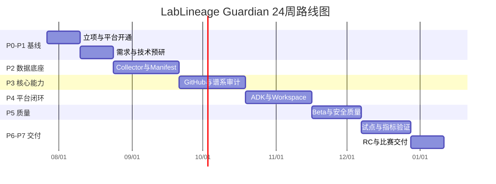

# 总体路线图与里程碑

## 1. 24 周相对计划

| 阶段 | 名称 | 时间 | 阶段目标 |
| --- | --- | --- | --- |
| P0 | 立项与平台开通 | 第1–2周 | 项目边界、比赛资源、云账号、仓库与协作方式确定 |
| P1 | 需求验证与技术预研 | 第3–4周 | 样例项目、威胁模型、数据契约与关键技术 Spike 通过 |
| P2 | 边缘采集与数据底座 | 第5–8周 | Collector、无 Git 快照、Manifest、数据库与导入链路可用 |
| P3 | 谱系与审计核心 | 第9–12周 | GitHub 对齐、谱系引擎、可复现评分和结果筛选可用 |
| P4 | Gemini 平台与 Workspace 闭环 | 第13–16周 | ADK Agent、Runtime、Registry、Gateway、Drive/Sheets/Gmail 跑通 |
| P5 | Beta、质量与安全 | 第17–19周 | 端到端 Beta、Agent 评测、安全测试、可观测性与发布流程完成 |
| P6 | 课题组试点与指标验证 | 第20–22周 | 真实或高度拟真的试点、问题闭环、量化效果与案例沉淀 |
| P7 | 发布候选与比赛交付 | 第23–24周 | RC 版本、演示环境、项目书、视频、答辩材料和最终验收 |

## 2. Mermaid 路线图

> 图中的起始日期只用于展示相对长度。实际执行时以项目正式启动日平移。

## 3. 里程碑

| 里程碑 | 名称 | 目标时间 | 退出条件摘要 |
| --- | --- | --- | --- |
| M0 | 项目基线冻结 | 第2周末 | 章程、范围、RACI、风险初版和仓库完成 |
| M1 | 平台最小链路通过 | 第4周末 | Gemini API 调用、ADK 本地 Agent、Runtime 部署 Spike、Registry/Gateway 可行性验证 |
| M2 | Collector Alpha | 第8周末 | 本地扫描、哈希、快照、离线 Bundle、云端幂等导入 |
| M3 | Lineage Alpha | 第12周末 | 关键图谱系、GitHub commit 匹配、R0–R3 评分、Finding 输出 |
| M4 | 平台端到端 Alpha | 第16周末 | 用户提问到报告、Sheet 和 Gmail 草稿的完整闭环 |
| M5 | Beta 冻结 | 第19周末 | 安全、测试、评测、日志、部署和恢复流程达到 Beta 门槛 |
| M6 | 试点验收 | 第22周末 | 至少 3 类项目数据完成试点并形成量化结果 |
| M7 | Release Candidate | 第24周末 | 比赛演示、代码、文档和答辩材料全部可重复交付 |

## 4. 阶段 Gate 规则

### Gate A：允许进入 P2

- 比赛账号、Cloud 项目和额度边界已确认；
- Gemini API、ADK 本地、Runtime/Registry/Gateway Spike 至少有明确结果；
- PRD、数据契约和威胁模型初版完成；
- 样例项目与黄金缺陷集可用。

### Gate B：允许进入 P3

- Collector 能产生有效签名 Bundle；
- 无 Git 两次快照 diff 可用；
- 云端导入幂等且 Schema 校验稳定；
- 任何原始数据外传问题均已解决。

### Gate C：允许进入 P4

- 可对至少一张图建立确定性或高可信谱系；
- 能发现服务器脚本与 GitHub commit 冲突；
- 可复现评分和主要 Finding 有自动测试；
- 关键查询 API 稳定。

### Gate D：允许进入 Beta

- ADK Agent 端到端闭环可用；
- Runtime、Registry、Gateway 不是模拟占位；
- Workspace 写操作均有预览与确认；
- 工具调用和证据引用可审计。

### Gate E：允许进入试点

- P0/P1 安全和质量问题关闭；
- 试点授权、脱敏和退出机制完成；
- 备份、回滚和运行手册经过演练；
- 能在无网络或部分服务故障时安全降级。

### Gate F：允许发布候选

- 至少 3 类项目完成试点；
- 指标可复核，宣传数字不高于实测；
- 演示环境与代码版本冻结；
- 提交文档、视频和链接完成检查。
