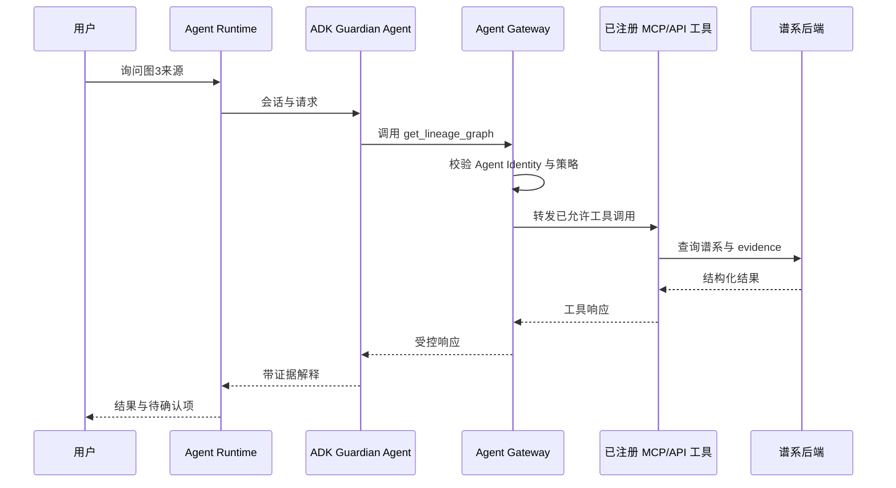

# ADK / Runtime / Registry / Gateway 集成路线

## 1. 最小正式链路

## 2. 分阶段实现

### Spike

- 一个 Agent；
- 一个只读工具；
- 一个 deny 工具；
- 一条 Gateway 策略；
- 一条 trace。

### Alpha

- Guardian Agent；
- Ingestion/Lineage API endpoint；
- GitHub/Workspace/Edge manifest 工具；
- 只读查询与写入预览；
- Registry 元数据与版本。

### Beta

- Agent Identity；
- 环境隔离；
- 权限和内容策略；
- 观察、成本和拒绝监控；
- 回滚和资源退役。

## 3. 验收矩阵

| 场景 | 预期 |
|---|---|
| Agent 查询谱系 | Gateway 允许，工具返回 evidence |
| Agent 请求原始文件 | Gateway 或工具策略拒绝 |
| Agent 创建 Gmail 草稿 | 用户确认后允许 |
| Agent 直接发送邮件 | 默认拒绝 |
| 未注册工具 | 拒绝并记录 |
| 跨项目资源 | 拒绝 |
| Registry 旧版本 | 标记弃用，不能被新 Agent 默认使用 |
| Runtime 绕过 Gateway | 测试中发现并阻止或产生告警 |
