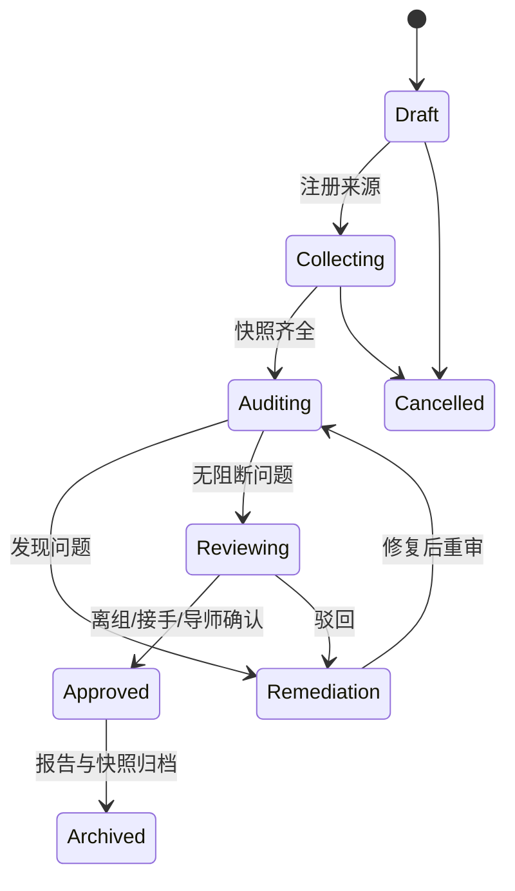

# 交接流程与状态机

## 1. Handoff 状态



## 2. 结果状态

```text
candidate → accepted
candidate → exploratory
candidate → duplicate
candidate → failed
candidate → superseded
candidate → quarantined
accepted → superseded
```

系统自动产生的是**提案**，正式状态由授权用户确认。

## 3. Finding 状态

```text
open → acknowledged → in_progress → resolved → verified
open → false_positive
open → accepted_risk
```

## 4. 角色确认

| 阶段 | 离组人 | 接手人 | 导师/管理员 |
|---|---|---|---|
| 来源注册 | 主责 | 知会 | 审核范围 |
| 首轮审计 | 解释历史 | 查看 | 关注 P0/P1 |
| 整改 | 补文件/提交代码 | 验证可用 | 决策风险接受 |
| 最终确认 | 声明交接 | 确认可接手 | 批准归档 |
